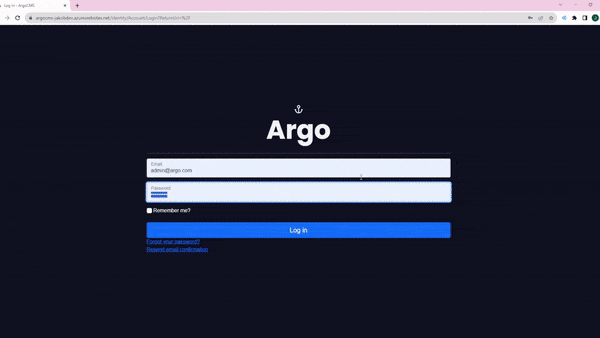

    

    

## Overview
The Argo Company Management System (Argo CMS) is a comprehensive web application designed to streamline workplace management and enhance team collaboration. Built using C#, ASP.NET Core, and EFCore, Argo CMS provides a robust platform for managing tasks, teams, and projects efficiently.

## Features
* **Real-time Notification System**: Using SignalR, Argo keeps its users informed with real-time notifications, creating instant feedback and communication.
* **Customised Microsoft Identity API**: User identity is tailored to meet the needs of Argo, while keeping with Microsoft's identity schema.
* **Interactive Dashboard**: The dashboard provides stastics about employee tasks and team performance.
* **Role-based Authorisation**: Argo uses a role-based authorisation system, ensuring secure access control based on user roles.
* **CRUD Operations for Administrators**: Administrators can perform Create, Read, Update, and Delete operations for data management.

  ## Technology Stack

  * Design:
    * Figma
  * Frontend:
    * HTML
    * Bootstrap
    * JavaScript
  *  Backend:
      * C#
      * ASP.NET Core
      * EFCore
      * SignalR
 
## Deployment
The application is deployed to Azure, utilising GitHub for CI/CD.

## User Experience
Argo prioritises a user-friendly, dark-mode interface. 

## Setup
1. Clone the repository.
2. Open the project in Visual Studio 2022.
4. Click the green arrow on the tool bar to run.

## Future Enhancements
The project is open to future enhancements and addtional features. Feel free to suggest ideas or contribute to development.

