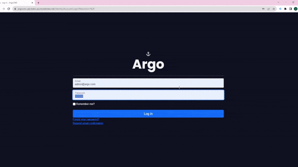

    

    

## Overview
The Argo Company Management System (Argo CMS) is a web application I made or my final project form my software engineering degree. Built using C#, ASP.NET Core, EF Core, and SignalR. The inspiration for this project was ServiceNOW.

## Features
* Realtime notififcations with SignalR.
* Dashboard providing stastics about employee tasks and team performance.
* Role-based authorisation system (e.g. only team leaders (and admins) can edit Teams).
* Full CRUD options for Admins.

  # Technology Stack
  * Frontend:
    * HTML
    * Bootstrap/CSS
    * JavaScript
  *  Backend:
      * C# (ASP.NET Core)
 
## Deployment
The application was deployed to Azure, utilising GitHub for CI/CD. 

## Setup
1. Clone the repository.
2. Open the project in Visual Studio 2022.
4. Click the green arrow on the tool bar to run.

## Future Enhancements
I have not touched this project since finishing my degree, but I had a lot of fun making this application. I don't have any major plans for this application apart from one day tidying up the code.